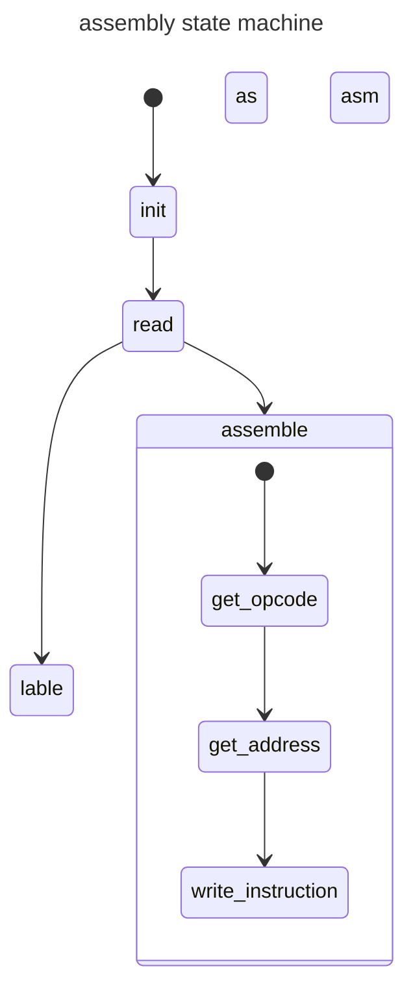

# Assembler
The assembler will take a .txt file tach contains the instructions and assemble it into a rom file.

## rom
The rom will be stored as a .lmc file that contains a 100 lines representing the address space, all addresses must be filled so when your program is only needs 7 addressees the 93 remaining spaces will be filled with `000` numbers.

## assembly
Needed for assembly are 3 lists:
|name|desc|
|---|---|
|source-code|Each entry in the list contains the source code that will be assembled to the corresponding memory address|
|assembled-instructions|Basically the memory that the computer will contain to run the program|
|lable-list|contains referencec to the lables used in the source code and the address that label corresponds to|

This state diagram will contain the assembly process.
